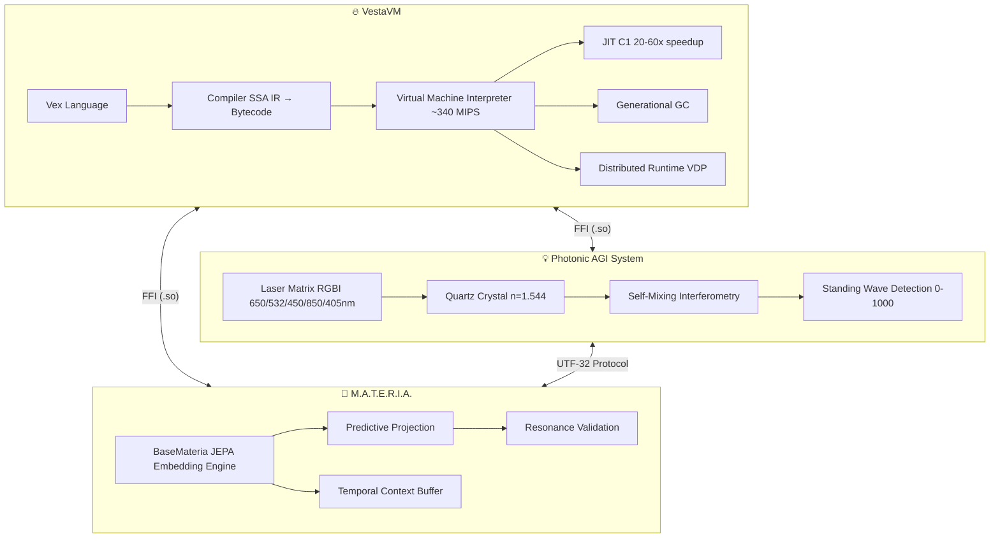
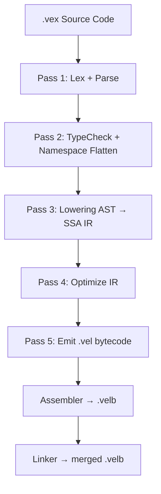
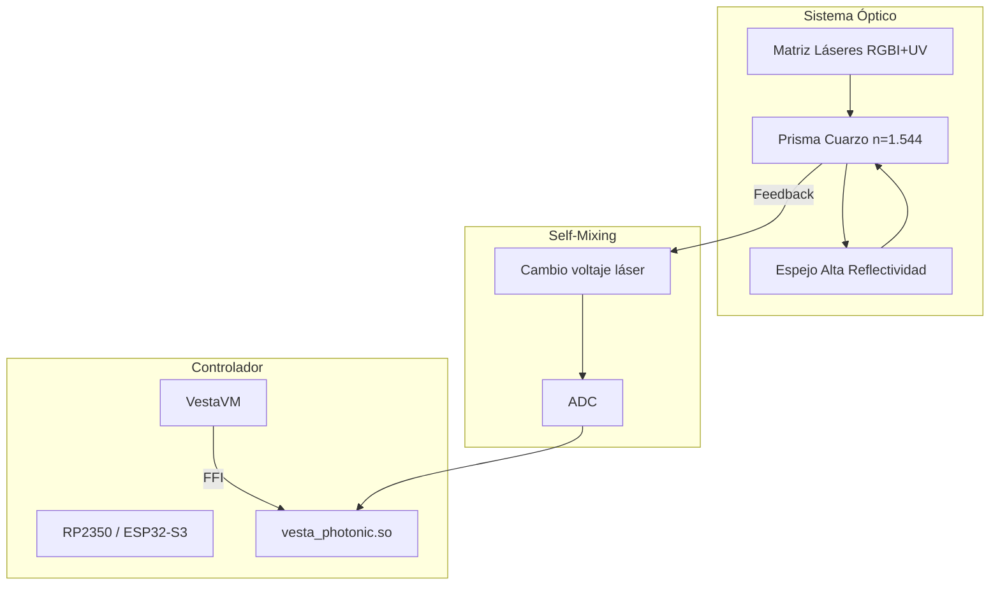
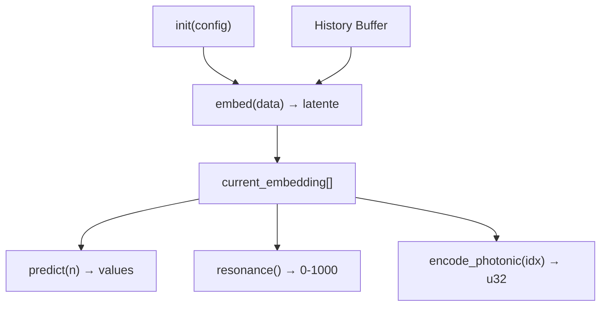
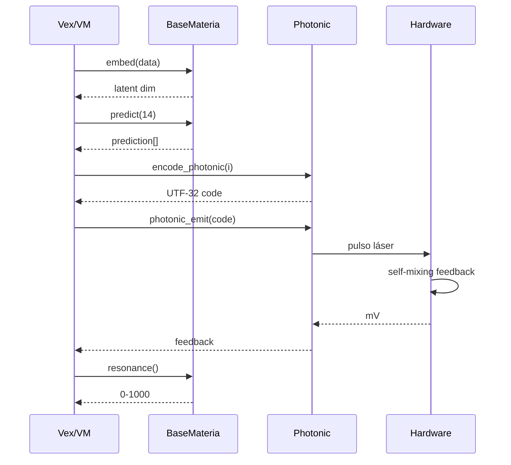

# VestaVM — Diagramas de Arquitectura

## 1. Arquitectura general del ecosistema

## 2. Pipeline del compilador Vex

## 3. Sistema Fotónico AGI

## 4. BaseMateria + JEPA

## 5. Integración: Fotónico + M.A.T.E.R.I.A. + Vex

